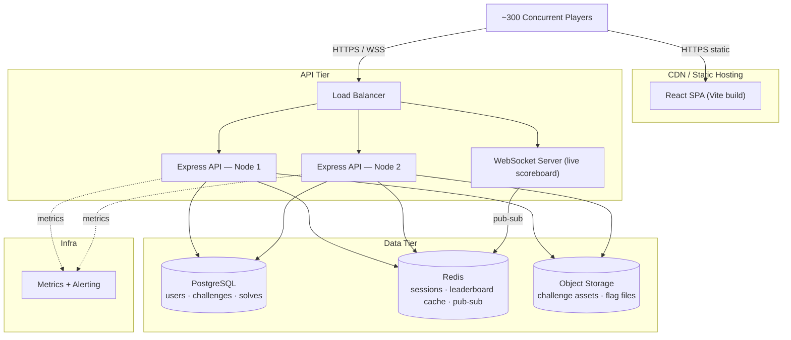

```mermaid
graph TD
    Players["~300 Concurrent Players"]

    subgraph CDN["CDN / Static Hosting"]
        SPA["React SPA (Vite build)"]
    end

    subgraph API["API Tier"]
        LB["Load Balancer"]
        API1["Express API — Node 1"]
        API2["Express API — Node 2"]
        WS["WebSocket Server (live scoreboard)"]
    end

    subgraph Data["Data Tier"]
        PG[("PostgreSQL\nusers · challenges · solves")]
        Redis[("Redis\nsessions · leaderboard cache · pub-sub")]
        S3[("Object Storage\nchallenge assets · flag files")]
    end

    subgraph Infra["Infra"]
        Monitor["Metrics + Alerting"]
    end

    Players -->|HTTPS static| SPA
    Players -->|HTTPS / WSS| LB
    LB --> API1
    LB --> API2
    LB --> WS
    API1 --> PG
    API2 --> PG
    API1 --> Redis
    API2 --> Redis
    WS -->|pub-sub| Redis
    API1 --> S3
    API2 --> S3
    API1 -.->|metrics| Monitor
    API2 -.->|metrics| Monitor
```
